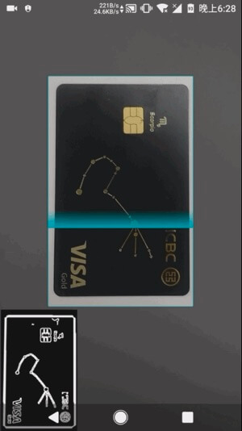

[English](README_EN.md)

**SmartCamera** 是一个 Android 相机拓展库，提供了一个高度可定制的**实时扫描模块**能够实时采集并且识别相机内物体边框是否吻合指定区域。如果觉得还不错，欢迎 star，fork。

语言描述起来略显生涩，具体实现的功能如下图所示，适用于身份证，名片，文档等内容的扫描、自动拍摄并且裁剪：


在相机实现上，SmartCamera 以源码的方式引用了 Google 开源的 [CameraView](https://github.com/google/cameraview) ，并且稍作修改以支持 Camera.PreviewCallback 回调来获取相机预览流。  

SmartCameraView 继承于修改后的 CameraView，为其添加了一个选框蒙版视图（MaskView）和一个实时扫描模块（SmartScanner）。其中选框视图即是你看到的相机上面的那层选取框，并配备了一个由上到下的扫描效果，当然你也可以实现 MaskViewImpl 接口来自定义选框视图。

**实时扫描模块（SmartScanner）是本库的核心功能所在，配合相机 PreviewCallback 接口回调的预览流和选框视图 MaskView 提供的选框区域 RectF，能以不错的性能实时判断出内容是否吻合选框**。

你也可以关注我的另一个库 [SmartCropper](https://github.com/pqpo/SmartCropper)： 一个简单易用的智能图片裁剪库，适用于身份证，名片，文档等照片的裁剪。

## 扫描算法调优
另外 SmartScanner 提供了丰富的配置，使用者可以自己修改扫描算法以获得更好的适配性（如下图一），为了更方便、高效地调优算法，SmartScanner 贴心地为你提供了扫描预览模式（如下图二）

开启预览功能后，你可以通过 SmartScanner 获取每一帧处理的结果输出到 ImageView 中实时观察 native 层扫描的结果，其中白线区域即为边缘检测的结果，白线加粗区域即为识别出的边框。  

**你的目标是通过调节 SmartScanner 的各个参数使得内容边界清晰可见，识别出的边框（白色加粗线段）准确无误**。

注：SmartCamera 在各方面做了性能以及内存上的优化，但是出于不必要的性能资源浪费，算法参数调优结束后请关闭预览模式。

|||
|:---:|:---:|
|图1. 算法调节参数|图二. 实时预览模式|

## 接入

1.根目录下的 build.gradle 添加：

```groovy
allprojects {
        repositories {
            ...
            maven { url 'https://jitpack.io' }
        }
}
```

2.添加依赖

```groovy
dependencies {
      implementation 'com.github.pqpo:SmartCamera:v1.0.0'
}
```

注意：由于使用了 JNI， 请**避免混淆**

```
-keep class me.pqpo.smartcameralib.**{*;}
```

## 使用

### 1. 引入相机布局，并启动相机（必要时启动预览）

```xml
<me.pqpo.smartcameralib.SmartCameraView
        android:id="@+id/camera_view"
        android:layout_width="match_parent"
        android:layout_height="match_parent"/>
```

```java
@Override
protected void onResume() {
   super.onResume();
   mCameraView.start();
   mCameraView.startScan();
}


@Override
protected void onPause() {
   mCameraView.stop();
   super.onPause();
   if (alertDialog != null) {
       alertDialog.dismiss();
   }
   mCameraView.stopScan();
}
```
注：若开启了预览别忘了调用相应开启、结束预览的方法。

### 2. 配置蒙版选框视图（可选，若要修改默认的视图, 或要修改选框区域）

	配置 MaskView 各个方法的含义详见附录二
	

```java
final MaskView maskView = (MaskView) mCameraView.getMaskView();;
maskView.setMaskLineColor(0xff00adb5);
maskView.setShowScanLine(true);
maskView.setScanLineGradient(0xff00adb5, 0x0000adb5);
maskView.setMaskLineWidth(2);
maskView.setMaskRadius(5);
maskView.setScanSpeed(6);
maskView.setScanGradientSpread(80);
mCameraView.post(new Runnable() {
      @Override
      public void run() {
          int width = mCameraView.getWidth();
          int height = mCameraView.getHeight();
          if (width < height) {
              maskView.setMaskSize((int) (width * 0.6f), (int) (width * 0.6f / 0.63));
              maskView.setMaskOffset(0, -(int)(width * 0.1));
           } else {
              maskView.setMaskSize((int) (width * 0.6f), (int) (width * 0.6f * 0.63));
           }
      }
});
mCameraView.setMaskView(maskView);
        
```

### 3. 修改扫描模块参数（可选，调优算法，同时按第四步中开启预览模式）

	扫描模块各个参数含义详见附录一

```java
private void initScannerParams() {
     SmartScanner.DEBUG = true;
     SmartScanner.detectionRatio = 0.1f;
     SmartScanner.checkMinLengthRatio = 0.8f;
     SmartScanner.cannyThreshold1 = 20;
     SmartScanner.cannyThreshold2 = 50;
     SmartScanner.houghLinesThreshold = 130;
     SmartScanner.houghLinesMinLineLength = 80;
     SmartScanner.houghLinesMaxLineGap = 10;
     SmartScanner.firstGaussianBlurRadius = 3;
     SmartScanner.secondGaussianBlurRadius = 3;
     SmartScanner.maxSize = 300;
     SmartScanner.angleThreshold = 5;
     // don't forget reload params
     SmartScanner.reloadParams();
}
```
注： 修改参数后别忘记通知 native 层重新加载参数： SmartScanner.reloadParams();

### 4. 配置 SmartCameraView

#### 1. 开启预览：

```java 
mCameraView.getSmartScanner().setPreview(true);
mCameraView.setOnScanResultListener(new SmartCameraView.OnScanResultListener() {
      @Override
      public boolean onScanResult(SmartCameraView smartCameraView, int result) {
          Bitmap previewBitmap = smartCameraView.getPreviewBitmap();
          if (previewBitmap != null) {
             ivPreview.setImageBitmap(previewBitmap);
          }
          return false;
      }
});
```
通过第一句代码开启了预览模式。  
你可以通过 setOnScanResultListener 设置回调获得每一帧的扫描结果，**其中 ```result == 1``` 表示识别结果吻合边框**  
若开启了预览模式，你可以在回调中使用 smartCameraView.getPreviewBitmap() 方法获取每一帧处理的结果。  
返回值为 false 表示不拦截扫描结果，这时 SmartCameraView 内部会在 result 为 1 的情况下自动触发拍照，若你自己处理了扫描结果返回 true 即可。

#### 2. 获取拍照结果，并且裁剪选框区域：

```java
mCameraView.addCallback(new CameraView.Callback() {
     @Override
     public void onPictureTaken(CameraView cameraView, byte[] data) {
          super.onPictureTaken(cameraView, data);
          // 异步裁剪图片
          mCameraView.cropImage(data, new SmartCameraView.CropCallback() {
              @Override
              public void onCropped(Bitmap cropBitmap) {
                  if (cropBitmap != null) {
                      showPicture(cropBitmap);
                  }
              }
       	);
   }
});
```

获取拍照结果的回调是 [CameraView](https://github.com/google/cameraview) 提供的，你只需要在内部调用 SmartCameraView 提供的 cropImage 方法即可获取选框区域内的裁剪图片

注：其他关于 SmartCameraView 的使用方法同 [CameraView](https://github.com/google/cameraview)  ，另外更具体的使用方法请参考 app 内代码

## 附录

### 1. 扫描模块（SmartScanner）识别算法参数介绍：

|参数名|默认值|备注|
|:---:|:---:|:--:|
|maxSize|300|为了提高性能，检测的图片会缩小到该尺寸之内，设置太小的话会影响检测效果|
|detectionRatio|0.1|检测范围比例，比例越小表示待检测物体需要更靠近边框才能检测通过|
|checkMinLengthRatio|0.8|线段最小长度检测比例,例如: 靠近上边框检测出一条线段长度为： checkLength, 上边框总宽度为：width, 那么如果 checkLength > width * checkMinLengthRatio 则 该线段符合检测条件，认为该线段为被检测物体上边框|
|angleThreshold|5|检测角度阈值，实际检测时会将夹角收敛到第一象限，若检测出的线段与坐标轴夹角小于该值则认为边框水平或者垂直，检测通过。|
| firstGaussianBlurRadius |3| 第一次高斯模糊半径，用于消除噪点，必须为正奇数，针对的是原图|
| secondGaussianBlurRadius |3| 第二次高斯模糊半径，用于消除噪点，必须为正奇数，针对的是灰度图|
| cannyThreshold1 |20|canny 算符阈值1|
| cannyThreshold2 |50|canny 算符阈值2，低于阈值1的像素点会被认为不是边缘， 高于阈值2的像素点会被认为是边缘， 在阈值1和阈值2之间的像素点,若与第2步得到的边缘像素点相邻，则被认为是边缘，否则被认为不是边缘。大小比例推荐2到3倍。用于调节使得边框清晰可见，同时减少干扰。|
| houghLinesThreshold |130| 最小投票数，要检测一条直线所需最少的的曲线交点，增大该值会减少检测出的线段数量。|
| houghLinesMinLineLength |80|能组成一条直线的最少点的数量, 点数量不足的直线将被抛弃。|
| houghLinesMaxLineGap | 10 |能被认为在一条直线上的点的最大距离，若出现较多断断续续的线段可以适当增大该值。|

### 2. 选框蒙版视图（MaskView）方法含义
|方法名|备注|
|:---:|:---:|
|setShowScanLine|设置是否显示扫描动画|
|setMaskLineWidth|设置中间选框线的宽度|
|setMaskLineColor|设置中间选框的颜色|
|setMaskRadius|设置中间选框圆角弧度|
|setMaskSize|设置选框的大小，默认居中|
|setMaskOffset|用于调整选框的位置|
|setMaskAlpha|设置选框区域外蒙版的透明度|
|setScanLineGradient|设置扫描线的渐变颜色|
|setScanGradientSpread|设置扫描线渐变的高度|
|setScanSpeed|设置扫描线移动速度|


## 感谢

- [Google/CameraView](https://github.com/google/cameraview)

---

## 关于我：

- 邮箱：    pqponet@gmail.com
- GitHub：  [pqpo](https://github.com/pqpo)
- 博客：    [pqpo's notes](https://pqpo.me)
- Twitter: [Pqponet](https://twitter.com/Pqponet)
- 微信公众号: pqpo_me(扫下方二维码)


## License

    Copyright 2017 pqpo
    
    Licensed under the Apache License, Version 2.0 (the "License");
    you may not use this file except in compliance with the License.
    You may obtain a copy of the License at
    
       http://www.apache.org/licenses/LICENSE-2.0
    
    Unless required by applicable law or agreed to in writing, software
    distributed under the License is distributed on an "AS IS" BASIS,
    WITHOUT WARRANTIES OR CONDITIONS OF ANY KIND, either express or implied.
    See the License for the specific language governing permissions and
    limitations under the License.
